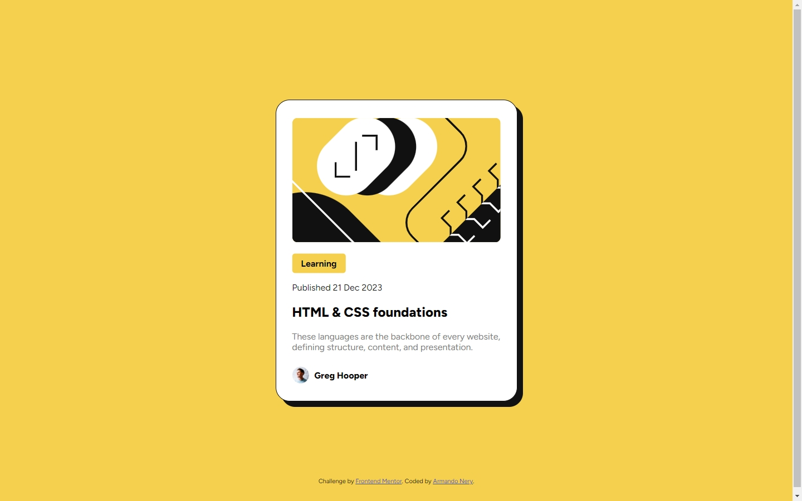
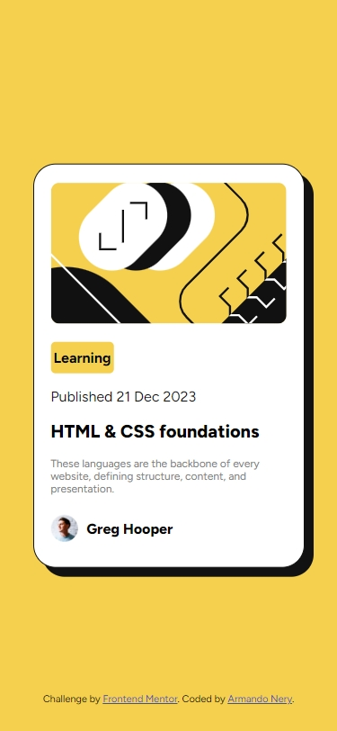

# Frontend Mentor - Blog preview card solution

This is a solution to the [Blog preview card challenge on Frontend Mentor](https://www.frontendmentor.io/challenges/blog-preview-card-ckPaj01IcS). Frontend Mentor challenges help you improve your coding skills by building realistic projects.

## Table of contents

- [Overview](#overview)
  - [The challenge](#the-challenge)
  - [Screenshot](#screenshot)
  - [Links](#links)
- [My process](#my-process)
  - [Built with](#built-with)
  - [What I learned](#what-i-learned)
  - [Continued development](#continued-development)
  - [Useful resources](#useful-resources)
- [Author](#author)

## Overview

### The challenge
Pelicate the card

### Screenshot
Desktop version


Responsive


### Links
- Solution URL: [https://www.frontendmentor.io/]
- Live Site URL: [https://advice-generator-seven.vercel.app/]

## My process

### Built with
-
-
-

### What I learned
Description and code snippets
```js
```

```css
```

### Continued development
Description
-
-
-

### Useful resources

- [Resource 1](https://resource1.com) - Description.
- [Resource 2](https://resource2.com) - Description.

## Author

- Website - [Armando Nery](https://portfolio-armandonery.vercel.app/)